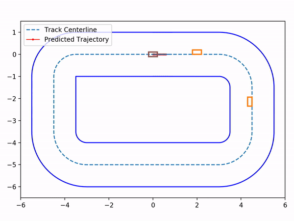
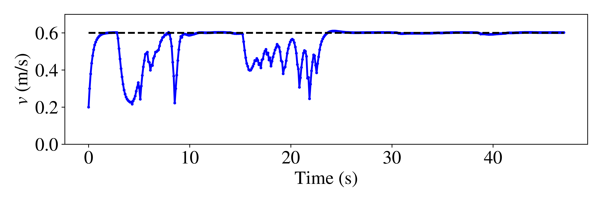

# MPC-CBF
Model Predictive Control with Control Barrier Functions

# Prerequisites
## Matlab
The packages needed for running the code are [Yalmip](https://yalmip.github.io/) and [IPOPT](https://projects.coin-or.org/Ipopt/wiki/MatlabInterface).

We also provide the zipped version of precompiled .mex files for IPOPT in the folder `packages` in case you don't have it. Unzip that file and add those .mex files into your MATLAB path.

# Description
## 2D double integrator
The 2D double integrator is assigned to reach the target position at origin while avoiding obstacles. We have three classes for different controllers: `DCLF_DCBF.m` (DCLF-DCBF), `MPC_CBF.m` (MPC-CBF) and `MPC_DC` (MPC-DC), respectively.

Moreover, to illustrate the performance among them, we have:
* `main.m`: Run DCLF-DCBF/MPC-CBF/MPC-DC respectively.
* `analysis_gamma.m`: Run analysis for different hyperparameter $\gamma$.
* `analysis_horizon.m`: Run analysis for different horizon.

We illustrate the performance between DCLF-DCBF/MPC-DC/MPC-CBF
| DCLF-DCBF  | MPC-DC (N=8) |
| --- | --- |
|  |  |

| MPC-CBF (N=1) | MPC-CBF (N=8) |
| --- | --- |
|  |  |

and also the safety performance for different numbers of horizon and hyperparameters
| Different hyperparameter | Different horizon |
| --- | --- |
|  |  |

## Car racing competition
We have the speed profile and control input shown as follow,  

The animation can be found on the top of this readme, we will release full code after the paper is accepted. 

# References
This repository is based on the following:
* Jun Zeng, Bike Zhang and Koushil Sreenath. "Safety-Critical Model Predictive Control with Discrete-Time Control Barrier Function." [[PDF]](http://arxiv.org/abs/2007.11718)
